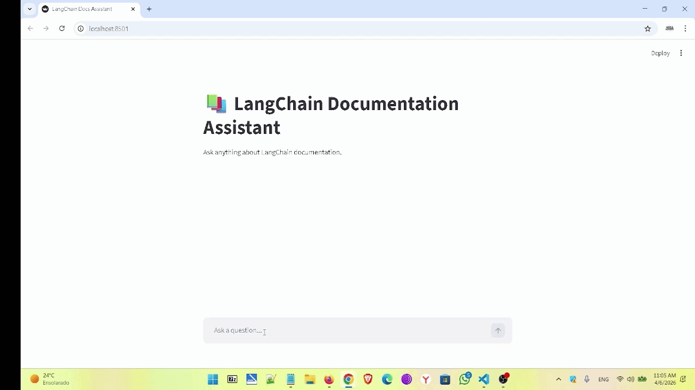

# 🔍 LangChain Docs Assistant

> Ask questions about any codebase in plain English. Get answers that cite exact files, functions, and line numbers.



---

## What it does

LangChain Docs Assistant is a **RAG (Retrieval-Augmented Generation)** system that lets developers query a codebase using natural language. Instead of reading through dozens of files, you simply ask:

- *"How does the authentication module work?"*
- *"Which functions handle payments?"*
- *"Where is user validation done?"*
- *"What does the OrderProcessor class do?"*

The assistant finds the relevant code and explains it — citing the exact file and line numbers.

---

## Demo

| Question | What happens |
|---|---|
| "How does authentication work?" | Retrieves JWT middleware + token decoder, explains the full flow |
| "Which functions handle payments?" | Finds `process_payment`, `validate_payment`, `_call_gateway` across files |
| "Where is user validation done?" | Identifies 3 separate validation points across 2 different modules |

---

## Architecture

```
User Question
      ↓
Convert to vector embedding (OpenAI text-embedding-3-small)
      ↓
Semantic search in Pinecone (find most relevant code chunks)
      ↓
Retrieved chunks injected into prompt
      ↓
GPT-4o explains the code, citing file + line numbers
      ↓
Answer displayed in Streamlit chat interface
```

### Ingestion Pipeline (runs once)

```
Local codebase (.py files)
      ↓
AST parsing — extract each function & class as a complete chunk
      ↓
Generate embeddings per chunk (OpenAI)
      ↓
Store in Pinecone with metadata: file path, function name, line numbers
```

---

## Why AST parsing?

Most RAG tutorials use a generic text splitter that cuts documents by character count. For code, this is a problem — it can split a function in half, destroying its meaning.

**AST (Abstract Syntax Tree)** parsing understands code structure. It knows exactly where each function and class begins and ends, so every chunk is always complete and semantically meaningful.

```python
# Each chunk looks like this in Pinecone:
Source: payments/processor.py — function process_payment (lines 42–78)

def process_payment(amount: float, currency: str) -> dict:
    """Process a payment transaction."""
    ...
```

---

## Tech Stack

| Layer | Technology |
|---|---|
| Frontend | Streamlit |
| LLM | GPT-4o (OpenAI) |
| Embeddings | text-embedding-3-small (OpenAI) |
| Vector Store | Pinecone |
| Agent Framework | LangChain + LangGraph (`create_react_agent`) |
| Code Parsing | Python AST (built-in) |

---

## Project Structure

```
langchain-docs-assistant/
├── fake_codebase/              # Simulated corporate codebase (indexed source)
│   ├── auth/
│   │   ├── authentication.py   # Login, JWT token generation & decoding
│   │   └── permissions.py      # Role checks, access control
│   ├── payments/
│   │   ├── processor.py        # process_payment, refund, validate
│   │   └── gateway.py          # Stripe/PayPal integration stubs
│   ├── database/
│   │   ├── models.py           # User, Order, Product models
│   │   └── connection.py       # DB connect, retry, connection pool
│   ├── api/
│   │   ├── routes.py           # REST endpoints
│   │   └── middleware.py       # Auth middleware, rate limiting
│   └── utils/
│       ├── validators.py       # Input validation helpers
│       └── error_handlers.py   # Custom exceptions, error formatting
├── backend/
│   └── core.py                 # LangGraph agent + retrieve_context tool
├── app.py                      # Streamlit chat interface
├── ingestion.py                # AST parsing + Pinecone indexing pipeline
├── consts.py                   # Global constants
├── logger.py                   # Colored CLI logging utility
└── gif.gif                     # Demo recording
```

---

## Getting Started

### Prerequisites

- Python 3.10+
- OpenAI API key
- Pinecone API key + index named `langchain-doc-index`
- Tavily API key

### Installation

1. **Clone the repository**
```bash
git clone https://github.com/yourusername/langchain-docs-assistant.git
cd langchain-docs-assistant
```

2. **Create and activate a virtual environment**
```bash
python -m venv venv
source venv/bin/activate        # macOS/Linux
.\venv\Scripts\activate         # Windows
```

3. **Install dependencies**
```bash
pip install -r requirements.txt
```

4. **Configure environment variables**

Create a `.env` file in the root directory:
```
OPENAI_API_KEY=your_openai_api_key
PINECONE_API_KEY=your_pinecone_api_key
TAVILY_API_KEY=your_tavily_api_key
```

5. **Run the ingestion pipeline**
```bash
python ingestion.py
```
This parses `fake_codebase/` with AST, generates embeddings, and indexes everything into Pinecone. Only needs to run once.

6. **Launch the app**
```bash
streamlit run app.py
```

Open `http://localhost:8501` in your browser.

---

## Key Design Decisions

**AST over text splitting** — Preserves function and class boundaries so every retrieved chunk is always complete and meaningful.

**LangGraph agent** — The LLM autonomously decides when and what to retrieve via a `retrieve_context` tool, rather than hardcoded retrieval logic.

**Metadata-rich vectors** — Every chunk stored in Pinecone carries file path, function name, and line numbers, enabling precise citations in answers.

**Async batch indexing** — The ingestion pipeline processes documents in parallel batches for efficient indexing at scale.

---

## License

[MIT License](LICENSE)
